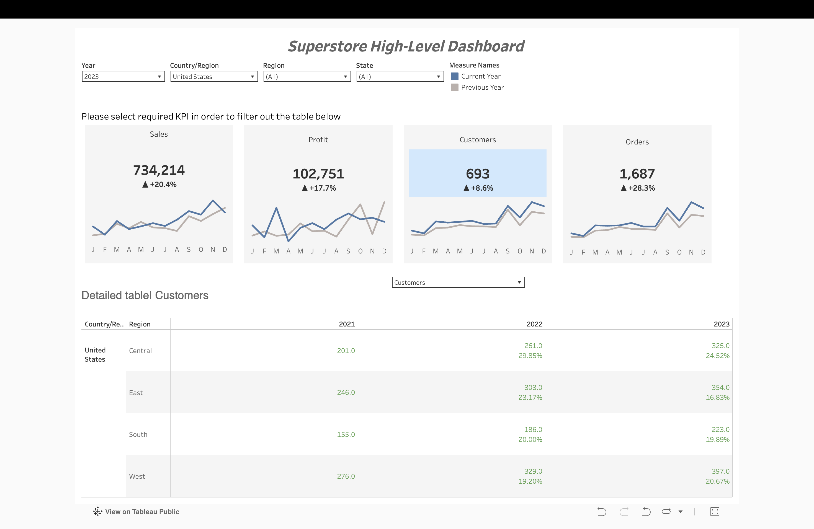

# 📊 Superstore High-Level Dashboard

An executive-style KPI dashboard built to practice year-over-year (YoY)
performance tracking with dynamic trend indicators.

🔗 **[View Live Dashboard on Tableau Public](https://public.tableau.com/app/profile/hanna.ivanova/viz/HW15_17583736697090/SuperHigh-LevelDashboard)**

## 📌 Project Overview
This is a learning project built to practice creating an executive
("at-a-glance") KPI dashboard — the kind of high-level summary view often
used in business reporting to track performance without digging into raw
data.

## 🎯 Features
- **4 key KPI cards**: Sales, Profit, Customers, Orders
- Each card shows:
  - The total value for the selected year
  - A **trend arrow** (▲/▼) with the percentage change compared to the
    previous year
  - A **sparkline** comparing the current year (blue) vs. previous year
    (grey) month by month
- **Interactive filters**: Year, Country/Region, Region, State
- **Two types of interactivity (Tableau Actions)**:
  - Clicking a **month** on a sparkline highlights that specific data point
    (current year vs. previous year) for quick month-to-month comparison
  - Clicking a **KPI card** (Sales/Profit/Customers/Orders) opens a
    detailed table below, broken down by Country/Region and Region,
    showing values and YoY % change across multiple years
- Conditional color formatting (green/red) to instantly flag growth vs.
  decline

## 🛠️ Tech Stack
- Tableau Public
- Sample Superstore dataset (Tableau's standard training dataset)

## 💡 What I Learned
- Building calculated fields to compare a selected period against the
  previous one (YoY comparisons)
- Creating dynamic trend indicators (arrows + % change) driven by
  calculated fields rather than static text
- Designing sparkline mini-charts inside KPI cards for quick visual context
- Using Tableau Actions (Highlight and Filter/Detail actions) to build
  two distinct types of interactivity within the same dashboard

## 📸 Preview

